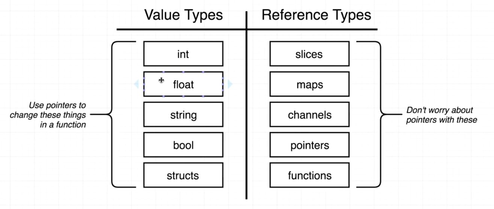
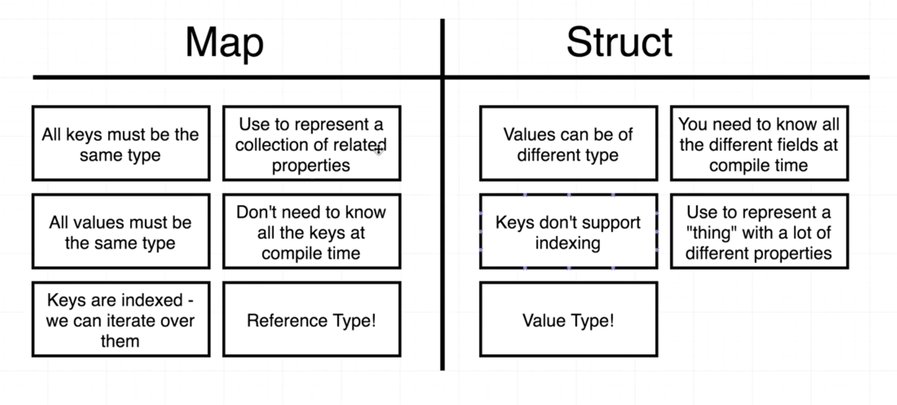

# ARE YOU READY?

## Why Go?
* It's **going** places!
* I really jive and mesh with Golang's design philosophy

## Notes
* no while loops, just for loops
* switch statements don't need `break` statements! w00t! (break statements already included)
* pointer syntax!
  * Turn an address into a value with *address
	* Turn a value into an address with %value
  * example (from Tour of Go)
    ```golang
    func main() {
      i, j := 42, 2701

      p := &i         // point to i
      fmt.Println(*p) // read i through the pointer
      *p = 21         // set i through the pointer
      fmt.Println(i)  // see the new value of i

      p = &j         // point to j
      *p = *p / 37   // divide j through the pointer
      fmt.Println(j) // see the new value of j
    }
      ```
* arrays have fixed lengths;
* use slices for dynamic arrays
* maps are **kind of** like JavaScript objects
* 

### Reference vs Value


### Maps
* What are maps?
  * keys and values are statically typed
  * can't use dot syntax for that reason
  * can be iterated over using range

* Maps vs. Structs
  * Maps can be iterated over while structs cannot
  * Map is a reference type while structs are value types
*  (Generally) Use Maps for
   *  representing a collection of closely related properties
      *  the color the hex value in /maps/main.go is a good example of this
*  (Generally) Use Structs for
   *  represent a "thing with a lot of different properties and methods
      *  /cards/deck is a good example of this

### Interfaces
* Very abstract topic
* Needs code practice to really understand
* example code is in /interfaces/main.go
* 