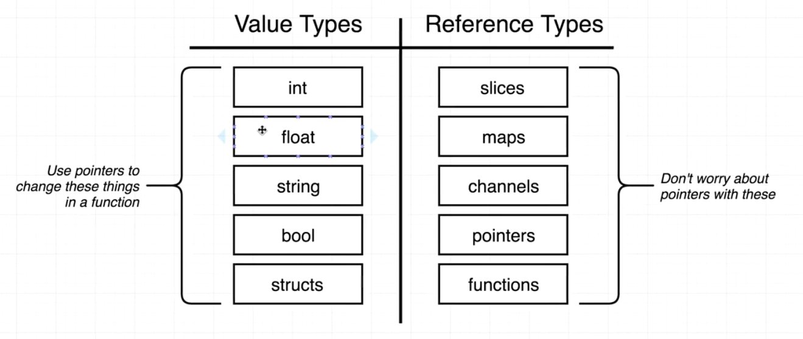

# ARE YOU READY?

## Why Go?
* I believe Go will, well, go far. 
* I also believe my instincts and preferences are likey mesh well with Golang.
* As a result, I've decided to start learning it. I'll be building projects in Go soon, but this will be my playground.

## Notes

