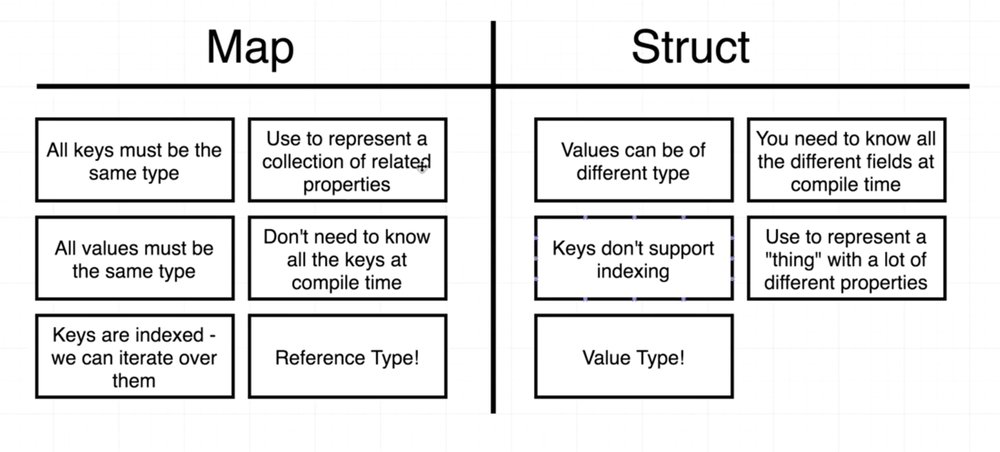

# ARE YOU READY?

## Why Go?
* I believe Go will, well, go far. 
* I also believe my instincts and preferences are likey mesh well with Golang.
* As a result, I've decided to start learning it. I'll be building projects in Go soon, but this will be my playground.

## Notes

### Maps
* What are maps?
  * keys and values are statically typed
  * can't use dot syntax for that reason
  * can be iterated over using range

* Maps vs. Structs
  * Maps can be iterated over while structs cannot
  * Map is a reference type while structs are value types
*  (Generally) Use Maps for
   *  representing a collection of closely related properties
      *  the color the hex value in /maps/main.go is a good example of this
*  (Generally) Use Structs for
   *  represent a "thing with a lot of different properties and methods
      *  /cards/deck is a good example of this

### Interfaces
* Very abstract topic
* Needs code practice to really understand
* example code is in /interfaces/main.go
* 